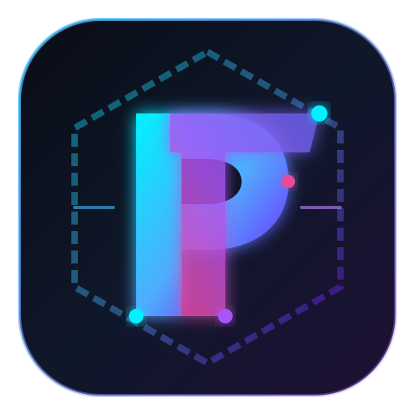

# Protutech Dash (protutechdash) 🚀

> **The Central Cross-Platform App Launcher & Suite Dashboard for the Protutech Ecosystem.**  
> Inspired by the Adobe Creative Cloud Suite experience, unified across Web, Mobile, and Desktop.



---

## ✨ Features

- 🎨 **Adobe Suite Aesthetic**:
  - High-tech, sleek interface modeled after Adobe Creative Cloud Desktop.
  - Iconic **2-letter stylized mnemonic badges** (`Dc`, `Hb`, `Px`, `Pl`, `Sf`, `Vw`, etc.) branched from the core **Protutech** geometric vector identity.
  - Category navigation, filter tabs, card grid, compact grid, and list views.

- 🩶 **Installed vs. Non-Installed Detection & Grayed-Out State**:
  - Apps not installed on the current system or device are **visually grayed out / desaturated**.
  - One-click setup/download guidance for uninstalled apps (e.g. `Protutech-Discord-Setup.exe`).
  - Active detection via local desktop companion bridge or manual status toggle.

- 🌓 **Dynamic Theming & Light/Dark Mode**:
  - Toggle between **Dark Mode** and **Light Mode**.
  - Pre-built theme palettes:
    - **Protutech Obsidian Neon** (Deep space with electric cyan and purple glows)
    - **Adobe Classic Dark** (Professional neutral carbon `#18181b`)
    - **Cyber Emerald** (High-tech terminal emerald `#10b981`)
    - **Sunset Ember** (Warm obsidian with amber/rose accents)
  - Color pickers and real-time live preview.

- 🔗 **Smart URL App Detection (`protutech.vip` Domain Locked)**:
  - Type or paste any `*.protutech.vip` URL (e.g. `homebox.protutech.vip`, `seafile.protutech.vip`, or any future subdomain) directly into the dashboard detector.
  - **Strict Domain Whitelist**: Enforces that only services on the `protutech.vip` domain are analyzed or added, strictly rejecting foreign or external websites.
  - **Auto-Derivation**: Automatically maps subdomains to their service metadata (Name, 2-letter Adobe mnemonic badge, Category, Theme color, and Supported platforms).
  - Automatically scrolls to and highlights existing apps with a glowing pulse animation if already present, or creates a new card if newly discovered.

- 🔒 **Security Whitelist (Launch Only My Apps)**:
  - Whitelist mechanism guaranteeing the launcher **only opens authorized Protutech apps and endpoints** (`*.protutech.vip`, `protutech://`, local environments), preventing external malicious injections.

- 🔀 **Drag-and-Drop Reordering & Customization**:
  - Smooth HTML5 and touch drag-and-drop to reorder apps.
  - Pin top apps with `📌` to lock them at the front of the dashboard.
  - Quick reorder arrows for touchscreens and accessibility.

- 👁️ **App Visibility & Hiding**:
  - Toggle visibility to hide unused or admin-only apps.
  - Built-in **Hidden Apps Manager** to review and restore hidden apps anytime.

- 📱 **Cross-Device Platform Compatibility (Web, Mobile, Desktop)**:
  - **PWA (Progressive Web App)**: Installable directly on Windows, macOS, Android, and iOS home screens.
  - Auto-detects device platform (`Desktop`, `Mobile`, `Web`).
  - Platform compatibility filters: "Gray out incompatible apps", "Hide incompatible apps", or "Show all".
  - **Device Simulator**: Preview in real-time how your suite looks on Mobile, Desktop, and Web from any screen.

- 🔌 **In-App Suite Switcher (Direct Access in Other Apps)**:
  - Embed the launcher into **any other Protutech app** (Homebox, Discord, Seafile, Vaultwarden, or custom web apps) with a single `<script>` tag.
  - Renders a sleek floating 9-dot Protutech switcher that opens an in-app slide-over drawer to jump between apps without leaving.

- ➕ **Future-Proof App Registration**:
  - Add any future app directly through the dashboard UI.
  - Automatic Adobe-style logo generator: derives custom 2-letter badges, colors, and gradients on the fly.
  - Export and import your configuration via JSON.

---

## 📁 Repository Structure

```
protutechdash/
├── index.html                   # Main Suite Dashboard entrypoint
├── manifest.json                # PWA Manifest for desktop/mobile install
├── sw.js                        # Service Worker for offline & PWA caching
├── README.md                    # Documentation & integration guides
├── assets/
│   └── protutech-logo.svg       # Official vector Protutech brand emblem
├── data/
│   └── default-apps.json        # Pre-configured Protutech ecosystem apps
├── src/
│   ├── app.js                   # Main application logic & reactive state
│   └── styles.css               # Adobe Suite design system & themes
├── embed/
│   ├── protutech-launcher.js    # Embeddable in-app switcher widget
│   └── demo-app.html            # Live demo of in-app launcher integration
└── desktop/
    ├── launch-helper.bat        # Windows protocol launch dispatcher
    ├── protutech-protocol.bat   # Registers 'protutech://' URI scheme
    └── protutech-bridge.js      # Local companion bridge for native apps
```

---

## 🚀 Quick Start

### 1. Run Locally
You can serve the dashboard with any static HTTP server or Node.js:

```bash
# Using Python
python -m http.server 8080

# Or using Node / npx serve
npx serve .
```

Open `http://localhost:8080` in your browser.

---

## 🔌 Embedding the Launcher Directly into Your Other Apps

To add the Protutech App Switcher to any of your other web applications, paste this single line before `</body>`:

```html
<script src="https://iandrexi.github.io/protutechdash/embed/protutech-launcher.js" data-position="top-right"></script>
```

### In React / Next.js:
```jsx
import { useEffect } from 'react';

export default function ProtutechSwitcher() {
  useEffect(() => {
    const script = document.createElement('script');
    script.src = 'https://iandrexi.github.io/protutechdash/embed/protutech-launcher.js';
    script.setAttribute('data-position', 'top-right');
    document.body.appendChild(script);
    return () => script.remove();
  }, []);
  return null;
}
```

### Interactive Demo:
Open `embed/demo-app.html` to see the live integration in action!

---

## 💻 Desktop Integration & Protocol Handler

To launch installed Windows applications directly via custom `protutech://` links:
1. Right-click `desktop/protutech-protocol.bat` and select **Run as Administrator**.
2. This registers the `protutech://` protocol in the Windows Registry to launch your applications via `launch-helper.bat`.
3. (Optional) Run the local companion daemon for file detection:
   ```bash
   node desktop/protutech-bridge.js
   ```

---

## ⌨️ Keyboard Shortcuts

| Shortcut | Action |
| :--- | :--- |
| `/` or `Ctrl + K` | Focus global search bar |
| `Ctrl + D` | Toggle Dark / Light mode |
| `1` - `9` | Quick launch pinned apps |
| `Escape` | Close any open modal / runner window |

---

## 📜 License
Apache-2.0 © Protutech (Andrex / IAndrexI)
